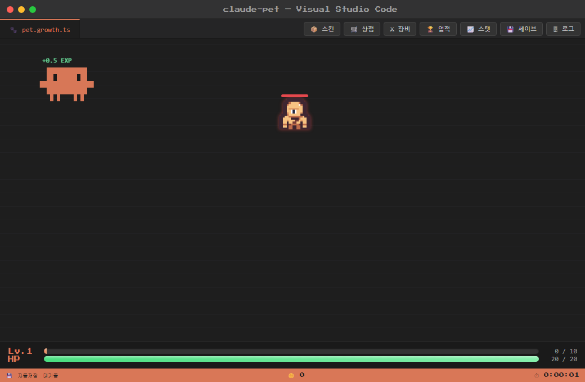

# claude-pet

VS Code를 흉내 낸 화면 안에서, Claude Code 마스코트가 알아서 몬스터를 잡고 성장하는 브라우저 방치형(idle) 게임입니다. 창을 열어두기만 하면 캐릭터가 자동으로 전투하며 레벨업하고, 모은 재화로 장비·스킨을 사서 꾸밀 수 있습니다.



## 소개

- 탭 제목은 `pet.growth.ts`, 상점은 `shop.json`, 세이브는 `save.manager`처럼 전부 IDE/코드 컨셉으로 이름 붙어 있습니다.
- 별도 조작 없이 자동으로 진행되는 방치형 게임이라, 켜두고 다른 일을 하면서 틈틈이 확인하는 방식으로 플레이합니다.
- 순수 HTML/CSS/JavaScript로만 만들어져 빌드 과정 없이 브라우저에서 바로 실행됩니다.

## 주요 기능

- **자동 성장** — 몬스터가 주기적으로 등장하고, 캐릭터가 자동으로 전투해 EXP·레벨·능력치(HP/ATK/DEF/SPD/LUK)를 올립니다.
- **장비 시스템** — 무기·방패·방어구 3슬롯. 레벨업으로 해금되거나 상점에서 구매해 장착하면 능력치가 강화됩니다.
- **스킨 & 액세서리** — 레벨에 따라 안경, 헤드폰, 크라운 등 액세서리가 해금되고, 코인으로 특별 스킨을 구매할 수 있습니다.
- **상점(커밋 코인)** — 몬스터를 처치해 얻는 "커밋 코인"으로 능력치 강화·스킨·장비를 구매합니다.
- **상자(가챠)** — 맵에 랜덤으로 상자가 등장하며, 열면 랜덤 장비/스킨을 얻을 수 있습니다.
- **업적** — 처치 수, 구매, 상자 개봉, 레벨 마일스톤 등을 자동으로 추적하고 달성 시 알림을 띄웁니다.
- **로그라이트 사망 페널티** — 사망하면 EXP가 깎이고(레벨 다운 가능), 일정 시간 공격력·이동속도가 감소하는 그로기 상태가 됩니다.
- **세이브** — 자동저장과 함께, 세이브 코드를 내보내기/불러오기로 수동 백업·이전할 수 있습니다.

## 실행 방법

정적 파일이라 브라우저에서 `index.html`을 열면 되지만, 게임이 `version.json`을 fetch로 불러오기 때문에 `file://`로 직접 열면 일부 기능이 막힐 수 있습니다. 로컬 서버로 띄워서 실행하는 것을 권장합니다.

```bash
# 예: node가 있다면
npx http-server -p 8080

# 이후 브라우저에서 http://localhost:8080 접속
```

## 기술 스택

- Vanilla JavaScript / HTML / CSS (프레임워크·빌드 도구 없음)
- 진행 상황은 브라우저 `localStorage`에 저장

## 크레딧

사용된 에셋과 라이선스는 [CREDITS.md](CREDITS.md)를 참고하세요.
